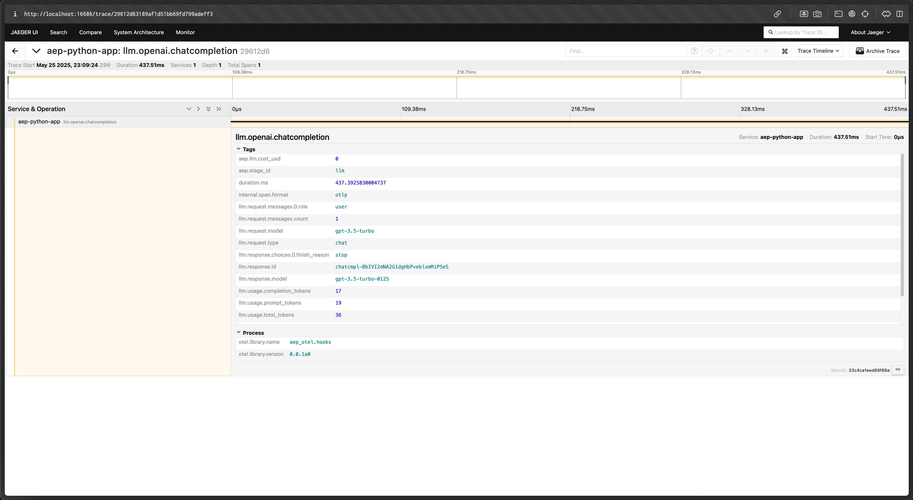
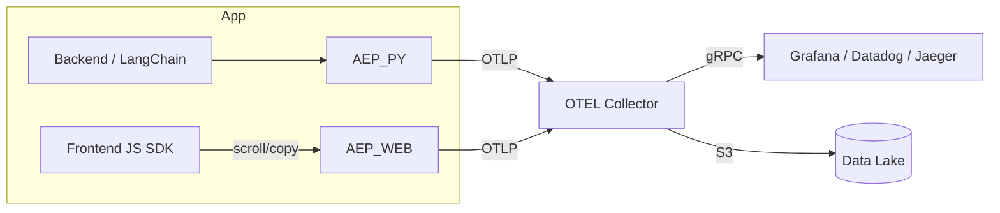

# Attention-Event-Protocol (AEP) — OTEL SDK Suite

> "Ship thin, freeze fast, grow wide."

Welcome! This repository houses the multi-language SDKs and tooling that emit **Attention-Event-Protocol (AEP)** spans in standard OpenTelemetry format. AEP aims to make it one copy-paste away for any LLM stack to log retrieval lists, model attention, and human attention, unlocking cost transparency, root-cause debugging, compliance, and future data flywheels.

See the [Master Blueprint (zero-to-one.md)](./zero-to-one.md) for the full vision, specification, and roadmap.

## Quick-Start: Python SDK (Alpha) with Local Collector & Jaeger

This quick-start will guide you through running the Python OpenAI example with a local OpenTelemetry Collector and Jaeger for trace visualization.

**Prerequisites:**
*   Python 3.9+
*   Docker and Docker Compose
*   An [OpenAI API Key](https://platform.openai.com/account/api-keys)

**Steps:**

1.  **Clone the repository:**
    ```bash
    git clone https://github.com/attention-event-protocol/aep-otel.git
    cd aep-otel
    ```

2.  **Set up your OpenAI API Key:**
    *   Copy the example .env file: `cp examples/env.example examples/python/.env`
    *   Edit `examples/python/.env` and add your `OPENAI_API_KEY`.

3.  **Start the local OpenTelemetry Collector and Jaeger:**
    *   In a new terminal window, navigate to the collector examples directory:
        ```bash
        cd examples/collector
        ```
    *   Start the services:
        ```bash
        docker-compose up -d
        ```
    *   This will start an OTEL Collector listening on `http://localhost:4318` (HTTP) and `localhost:4317` (gRPC), and a Jaeger UI accessible at [http://localhost:16686](http://localhost:16686).

4.  **Configure the Python example to send traces to the local collector:**
    *   Ensure your `examples/python/.env` file also includes:
        ```env
        OTEL_EXPORTER_OTLP_ENDPOINT="http://localhost:4318"
        ```
    *   (The Python SDK will automatically pick this up and send traces to this endpoint, in addition to the console.)

5.  **Run the Python OpenAI example:**
    *   Navigate to the Python SDK directory if you aren't already in the root (the `aep-otel` directory):
        ```bash
        # cd ../../ # if you were in examples/collector
        cd python/
        ```
    *   Install dependencies using Poetry. This step is crucial and must be run from *within* the `python/` directory:
        ```bash
        poetry install
        ```
    *   Run the example script (from within the `python/` directory):
        ```bash
        poetry run python ../examples/python/minimal_openai.py
        ```
    *   *Troubleshooting `ModuleNotFoundError`*: If you get a `ModuleNotFoundError`, ensure you have run `poetry install` successfully from *within* the `python/` directory. This command installs the necessary packages (like `openai`, `opentelemetry-sdk`) into the virtual environment used by `poetry run`.

6.  **View Traces in Jaeger:**
    *   Open your browser and go to [http://localhost:16686](http://localhost:16686).
    *   In the "Service" dropdown, select `aep-python-app` (or your custom `AEP_SERVICE_NAME` if set).
    *   Click "Find Traces". You should see a trace for the `llm.openai.chatcompletion` operation.

    

    You will also see trace information printed to your console (from `minimal_openai.py`) and in the OTEL collector logs (`docker-compose logs -f otel-collector-aep` in `examples/collector/`).

## Architecture Overview

The high-level architecture is described in [zero-to-one.md#3-high-level-architecture](./zero-to-one.md#3-high-level-architecture).


*This diagram shows the intended flow. The local collector example uses Jaeger.* 

## Repository Structure

```
.
├── .github/          # GitHub Actions workflows
├── docs/             # Documentation site (mkdocs-material, WIP)
├── examples/
│   ├── collector/    # OTEL Collector + Jaeger docker-compose setup
│   ├── python/       # Python SDK examples
│   └── env.example   # Example .env file for API keys
├── go/               # Go SDK (WIP)
├── node/             # Node.js SDK (WIP)
├── python/           # Python SDK (aep-otel package)
├── zero-to-one.md    # Master blueprint: spec, roadmap, vision
├── plan.md           # Developer task list (kanban-style)
├── progress.md       # Log of completed tasks
└── README.md         # This file
```

## Project Status & Milestones

Key milestones are tracked in `zero-to-one.md`. Current P-0/P-1 status:

| Phase             | Milestone                                     | Status | Notes                                                    |
|-------------------|-----------------------------------------------|--------|----------------------------------------------------------|
| **P-0 Bootstrap** | Repo skeleton `aep-otel`                      | ✅      | CI ✓, README stub                                        |
| **P-1 Prototype** | Patch-OpenAI 15-liner + local collector       | ✅      | Span printed to console & viewable in local Jaeger instance via OTEL Collector. Unit tests for patching pass. |
| P-2 Alpha SDK     | PyPI `0.1.0a` + Grafana dashboard gif         | ⬜️      |                                                          |
| P-3 Node parity   | npm `@aep/otel@0.1.0`                         | ⬜️      |                                                          |
| ...               | (See `zero-to-one.md` for full P-2 to P-10)   | ...    |                                                          |


---

### Contributing

Contributions are welcome! Please see `CONTRIBUTING.md` (TODO: create this file) for guidelines.

1.  Fork & `git clone`.
2.  Install development tools (e.g., Poetry for Python). See individual SDK READMEs.
3.  Create a feature branch.
4.  Make your changes. Ensure tests pass (e.g., `poetry run pytest` in `python/`).
5.  Open a pull request against the `main` branch.

---

© 2025 Mani Rash Ahmadi — MIT Licence 