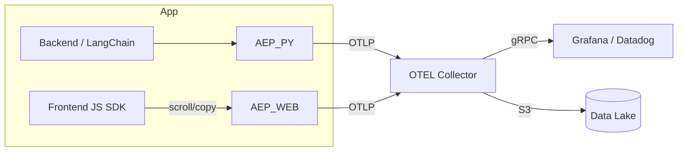

# Attention‑Event‑Protocol (AEP) — Master Blueprint  v1

*Single‑source, manager‑level specification guiding every technical and go‑to‑market step from today ➜ v1.0 public release.*  *(Last updated 25 May 2025)*

---

## 0. Executive Snapshot

**Mission:**  Make it one copy‑paste away for any LLM stack to log *retrieval lists + model attention + human attention* in OpenTelemetry format—unlocking cost transparency, root‑cause debugging, compliance, and future data flywheels.

**North‑Star KPI:**  *1 000 repositories emitting AEP spans by May 2026*.

---

## 1. Problem & Opportunity

| Pain                                | Today                                                       | AEP Fix                                                 |
| ----------------------------------- | ----------------------------------------------------------- | ------------------------------------------------------- |
| Token cost shocks                   | Cloud bill spikes, no per‑prompt trace                      | `llm.cost_usd` in every span                            |
| Hallucination & injection debugging | Missing link from retrieval → focus → user view             | `rank_before/after` + attention vectors, same trace\_id |
| Compliance & audit                  | EU‑AI‑Act asks for “traceability of prompts, data, outputs” | Append‑only JSONL + PDF export script                   |
| Learning data                       | Manual thumbs‑up sparse, clicks private                     | Implicit human + model attention fused into soft labels |

---

## 2. Objectives & Scope

1. **Spec Freeze v1.0** – immutable core fields by Week 8.
2. **Multi‑language SDKs** – Python & Node GA, Go beta.
3. **Zero‑config dashboards** – Grafana JSON + Datadog JSON.
4. **CI‑verified reference repo** – green matrix (Py 3.9‑3.12, Node 18‑22, Go 1.22).
5. **Compliance artifacts** – EU‑AI‑Act & SOC‑2 template export.
6. **Community traction** – 200 expert pilots → 30 public logos.

*Out of scope v1*: crypto incentives, deep ML retraining kits, mobile SDKs.

---

## 3. High‑Level Architecture

*Collectors may be local or cloud; fallback exporter writes JSONL.*

---

## 4. AEP Core Specification (v1‑draft)

| Field                                       | Req | Notes                                 |
| ------------------------------------------- | --- | ------------------------------------- |
| `trace_id`                                  | ✅   | OTEL trace id (UUID)                  |
| `stage_id`                                  | ✅   | `retrieval` `rerank` `llm` `frontend` |
| `doc_id`                                    | ⬜️  | present when doc context exists       |
| `rank_before` `rank_after`                  | ⬜️  | ints; -1 if n/a                       |
| `llm.attention[]`                           | ⬜️  | float32 list, len = docs or tokens    |
| `human.attention[]`                         | ⬜️  | dwell / gaze scores                   |
| `llm.prompt_tokens` `llm.completion_tokens` | ✅   | ints                                  |
| `llm.cost_usd`                              | ✅   | float64                               |
| `ts`                                        | ✅   | unix ns                               |
| *Extensions live in `metrics.*` attr bag.*  |     |                                       |

---

## 5. Work‑Package Breakdown & Checkpoints

| Phase                   | Wk  | Deliverable                             | Verification                            |
| ----------------------- | --- | --------------------------------------- | --------------------------------------- |
| **P‑0 Bootstrap**       | 0   | Repo skeleton `aep-otel`                | CI ✓, README stub                       |
| **P‑1 Prototype**       | 1   | Patch‑OpenAI 15‑liner + local collector | Span printed, unit test passes          |
| **P‑2 Alpha SDK**       | 2   | PyPI `0.1.0a` + Grafana dashboard gif   | Demo gif, issue #10 closed              |
| **P‑3 Node parity**     | 3   | npm `@aep/otel@0.1.0`                   | Jest tests green                        |
| **P‑4 Spec freeze**     | 4–8 | `spec.md v1.0` PR merged                | Hash of core fields locked, version tag |
| **P‑5 Pilot wave**      | 4–6 | 200‑email campaign                      | KPI: ≥20 installs (collector ping)      |
| **P‑6 Beta docs site**  | 6   | mkdocs site on gh‑pages                 | Lighthouse score >90                    |
| **P‑7 Compliance pack** | 7   | `export_to_pdf.py` + AI‑Act template    | Generates sample PDF, auditor review    |
| **P‑8 v0.9 RC**         | 8   | tag `v0.9.0` all languages              | CI + release‑please auto publish        |
| **P‑9 Public Launch**   | 10  | HackerNews / blog post                  | GitHub stars ≥500 in 30 days            |
| **P‑10 OTEL WG PR**     | 12  | Example exporter PR merged              | Official linkback                       |

---

## 6. Tech Stack & Tooling

| Layer      | Choice                           | Reason                            |
| ---------- | -------------------------------- | --------------------------------- |
| Language   | Python 3.9‑3.12, TS 5.x, Go 1.22 | Cover 90 % backend codebases      |
| Build      | Poetry, pnpm, Go modules         | Reproducible builds               |
| CI         | GitHub Actions + release‑please  | Automated semver & publishing     |
| Docs       | mkdocs‑material                  | Fast, searchable, GH‑pages native |
| Dashboards | Grafana JSON, Datadog JSON       | Zero‑click import for users       |
| Collector  | OTEL collector (binary)          | Vendor‑neutral, pluggable sinks   |

---

## 7. Risk Register & Mitigations

| Risk                              | Likelihood | Impact | Mitigation                                            |
| --------------------------------- | ---------- | ------ | ----------------------------------------------------- |
| Fragmentation by vendor formats   | M          | H      | Contribute to OTEL SIG early; keep spec minimal.      |
| Privacy pushback on human signals | M          | M      | `consent_scope` flag; default off; PII scrubber.      |
| Bandwidth (solo founder)          | H          | M      | Lean on OSS contributors; prioritise top‑value tasks. |
| Cost of hosting demo infra        | L          | M      | Use free Grafana Cloud, GitHub‑pages, small S3.       |

---

## 8. Governance Plan

* **Phase α** – Mani sole maintainer; MIT licence, CLA required.
* **Phase β** – Add 2–3 co‑maintainers from early adopters.
* **Phase γ** – Transfer spec to an open WG (OTEL Gen‑AI SIG or CNCF Sandbox).

---

## 9. Success Metrics (12‑month horizon)

| Bucket     | KPI                      | Target  |
| ---------- | ------------------------ | ------- |
| Adoption   | GitHub stars             | 5 000   |
|            | Repos emitting AEP       | 1 000   |
|            | Slack/Discord members    | 1 500   |
| Product    | Avg token‑cost reduction | ≥15 % │ |
|            | Avg MTTR for LLM bugs    | ↓50 %   |
| Community  | Trace uploads to commons | 5 TB    |
| Compliance | AI‑Act audits passed     | 3 logos |

---

## 10. Budget & Resources (est.)

| Item                  | Cost / mo | Notes                        |
| --------------------- | --------- | ---------------------------- |
| Domain + email        | \$12      | attention‑event‑protocol.dev |
| Grafana Cloud Starter | \$0       | 10k series; upgrade later    |
| S3 trace bucket       | \$20      | start at 200 GB              |
| GitHub CI             | \$0       | within free runner minutes   |
| *Total*               | **\$32**  | bootstrap‑friendly           |

*People:* solo founder (FT), 2 OSS part‑time collaborators (soon).

---

## 11. Next Action (Week 0)

1. **Create GitHub org + repo** (`attention-event-protocol/aep-otel`).
2. Push skeleton from *AEP\_Repo\_Structure\_v1* doc; CI must go green.
3. Patch OpenAI wrapper, capture first span, commit screenshot.
4. Update README with quick‑start; tag `0.0.1`.

> *Once these four boxes are ticked, Phase P‑1 is officially complete.*

---

“**Ship thin, freeze fast, grow wide**” – the mantra for every decision until v1.0.
